```text
██████╗ ██╗   ██╗███████╗████████╗██████╗ ██╗ ██████╗████████╗
██╔══██╗██║   ██║██╔════╝╚══██╔══╝██╔══██╗██║██╔════╝╚══██╔══╝
██████╔╝██║   ██║███████╗   ██║   ██████╔╝██║██║        ██║   
██╔══██╗██║   ██║╚════██║   ██║   ██╔══██╗██║██║        ██║   
██║  ██║╚██████╔╝███████║   ██║   ██║  ██║██║╚██████╗   ██║   
╚═╝  ╚═╝ ╚═════╝ ╚══════╝   ╚═╝   ╚═╝  ╚═╝╚═╝ ╚═════╝   ╚═╝   
             Windows Network Bandwidth Limiter & Controller
                                     v2.0.0 [Rust Core]
```

# Rustrict

> **High-performance Windows network bandwidth limiter, traffic shaper, and device manager — written in native Rust.**

Rustrict employs asynchronous Layer 2 ARP operations, multi-protocol identity resolution, kernel-level packet filtering (WinDivert + Npcap), and router UPnP/TR-064 gateway interrogation to discover, fingerprint, monitor, and regulate every device on a local network — all from a single Windows CLI.

---

## Table of Contents

- [Architecture Overview](#architecture-overview)
- [System Architecture Diagram](#system-architecture-diagram)
- [Module Dependency Graph](#module-dependency-graph)
- [Core Subsystems](#core-subsystems)
  - [1. Platform & Kernel Interface Layer](#1-platform--kernel-interface-layer)
  - [2. Scanner Subsystem](#2-scanner-subsystem)
  - [3. Identity & Resolution Subsystem](#3-identity--resolution-subsystem)
  - [4. Router Gateway Discovery (UPnP / TR-064)](#4-router-gateway-discovery-upnp--tr-064)
  - [5. MITM & Traffic Shaping Engine](#5-mitm--traffic-shaping-engine)
  - [6. State & Persistence Subsystem](#6-state--persistence-subsystem)
  - [7. Wireless Subsystem (802.11)](#7-wireless-subsystem-80211)
- [End-to-End Data Flow](#end-to-end-data-flow)
  - [Device Discovery Pipeline](#device-discovery-pipeline)
  - [Traffic Throttling & MITM Pipeline](#traffic-throttling--mitm-pipeline)
  - [Persistent Block Lifecycle](#persistent-block-lifecycle)
- [CLI Command Reference](#cli-command-reference)
- [Requirements](#requirements)
- [Building from Source](#building-from-source)
- [Project Structure](#project-structure)
- [Test Suite](#test-suite)
- [External Dependencies](#external-dependencies)

---

## Architecture Overview

Rustrict is organized into seven architectural layers, each responsible for a distinct concern in the network management pipeline:

| Layer | Modules | Responsibility |
| :--- | :--- | :--- |
| **CLI & Presentation** | `src/cli/`, `src/main.rs` | Interactive REPL shell, ANSI-colored device tables, target resolution, argument parsing |
| **Platform & Kernel Interface** | `src/platform/`, `build.rs` | Windows API bindings (`SendARP`, `IsUserAnAdmin`), PowerShell automation, WinDivert/Npcap dynamic linking |
| **Scanner** | `src/scanner/` | Parallel ARP subnet sweeping via Rayon, rate-limited in batches of 48 to prevent router queue exhaustion |
| **Identity & Resolution** | `src/resolver/`, `src/gateway/` | 10-protocol hostname fingerprinting chain, OUI vendor lookup, router UPnP/TR-064 SOAP interrogation |
| **MITM & Traffic Shaping** | `src/spoofer/`, `src/limiter/`, `src/monitor/` | Bidirectional ARP cache poisoning, WinDivert kernel packet interception, token-bucket rate limiting |
| **State & Persistence** | `src/state.rs` | JSON-backed durable block rules surviving restarts and rescans |
| **Wireless (802.11)** | `src/wireless/` | Deauth frame crafting, Radiotap parsing, 4-way WPA handshake / PMKID inspection |

---

## System Architecture Diagram

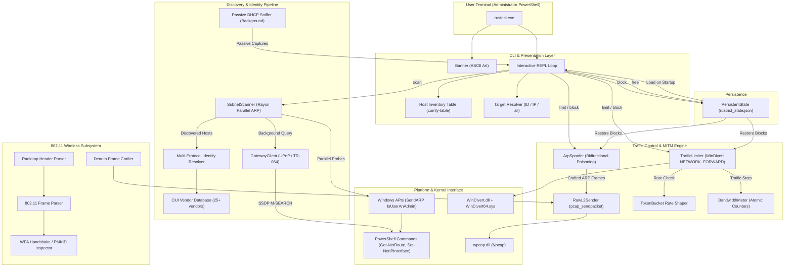

---

## Module Dependency Graph

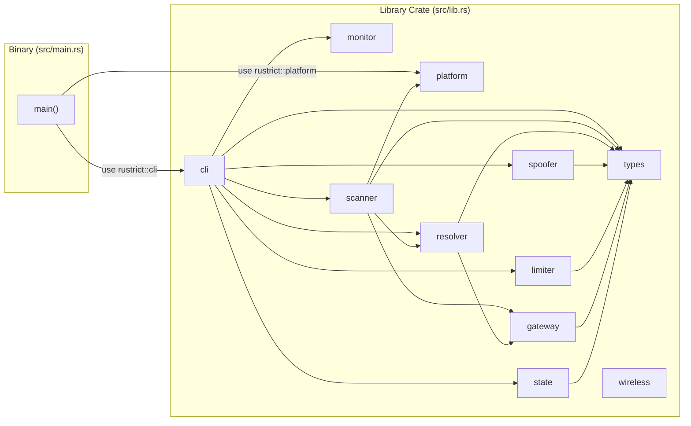

---

## Core Subsystems

### 1. Platform & Kernel Interface Layer

The platform layer (`src/platform/`) provides the bridge between Rustrict and the Windows kernel. A compile-time guard rejects non-Windows targets:

```rust
#[cfg(not(windows))]
compile_error!("Rustrict is built specifically for Windows (Windows 10/11 x64).");
```

**Key operations performed through this layer:**

| Function | Mechanism | Purpose |
| :--- | :--- | :--- |
| `is_privileged()` | Win32 `IsUserAnAdmin()` | Verify Administrator elevation |
| `send_arp(ip)` | Win32 `SendARP` (iphlpapi.dll) | Synchronous kernel-level ARP resolution |
| `get_arp_cache()` | Parses `arp -a` output | Seed scanner with known devices |
| `get_default_interface()` | PowerShell `Get-NetRoute`, `Get-NetIPAddress`, `Get-NetAdapter` | Auto-detect active NIC, gateway IP/MAC, local IP/MAC, Npcap device path |
| `enable_ip_forwarding()` | PowerShell `Set-NetIPInterface -Forwarding Enabled` | Required for MITM packet forwarding |
| `disable_ip_forwarding()` | PowerShell `Set-NetIPInterface -Forwarding Disabled` | Clean shutdown restoration |

**The build system** (`build.rs`) automatically locates and bundles WinDivert binaries (`WinDivert.dll`, `WinDivert64.sys`) from Anaconda/pip `pydivert` site-packages or local directories into the target output folder.

---

### 2. Scanner Subsystem

The scanner (`src/scanner/arp.rs`) performs high-speed parallel ARP sweeps across IPv4 subnets:

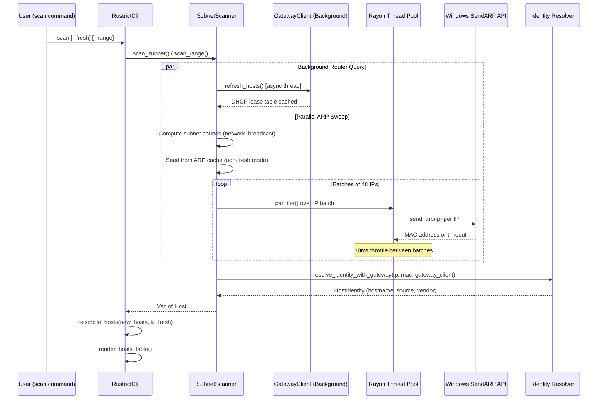

**Key design decisions:**
- **Batch size of 48** with **10ms inter-batch delays** prevents consumer routers from dropping ARP frames due to queue exhaustion.
- **Non-fresh scans** pre-seed from the Windows kernel ARP cache (`arp -a`), reducing network traffic for already-known devices.
- **Fresh scans** (`--fresh`) purge all offline, unmanaged entries from the table while strictly preserving any host with active limits, blocks, or persistent rules.

---

### 3. Identity & Resolution Subsystem

Rustrict resolves device hostnames through a **10-protocol priority chain**, stopping at the first successful identification:

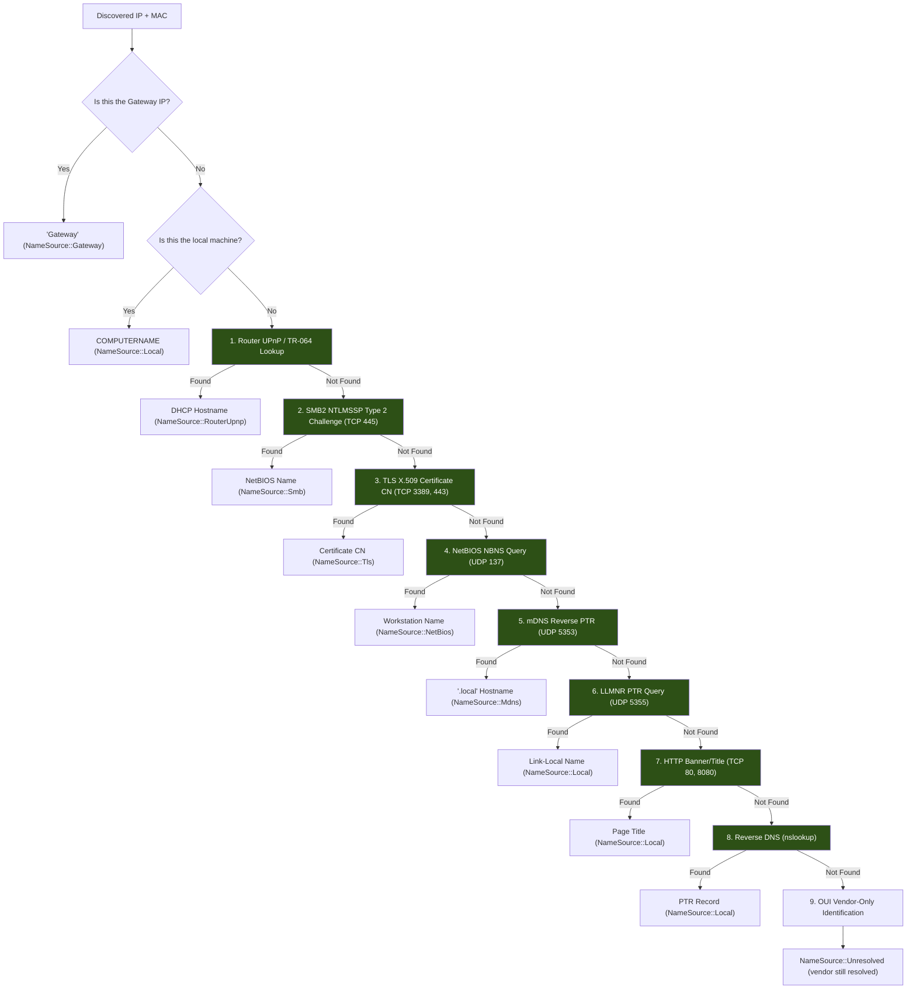

**Additionally**, a **passive background sniffer** (`PassiveIdentitySniffer`) runs continuously in a separate thread, capturing broadcast DHCP packets via Npcap promiscuous mode and extracting **DHCP Option 12 (Host Name)** from BOOTP/DHCP exchanges. These passively discovered identities are merged into the host table on every `hosts` command.

**OUI Vendor Database** covers 25+ manufacturers including Apple, Samsung, Xiaomi, Google, Amazon, Intel, Realtek, TP-Link, Cisco, Dell, HP, Lenovo, and more. Randomized MACs (locally administered bit set) are detected and flagged.

---

### 4. Router Gateway Discovery (UPnP / TR-064)

The gateway module (`src/gateway/`) queries the local router's UPnP `LANHostConfigManagement:1` service to extract the authoritative DHCP lease table — providing device names that are impossible to obtain by probing endpoints directly (e.g., firewalled smartphones, IoT devices, smart TVs).

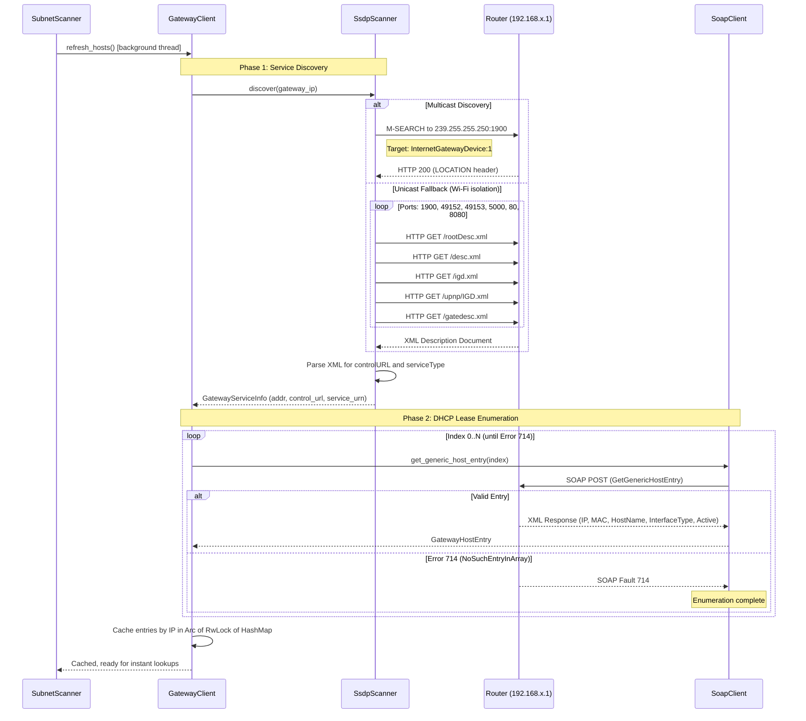

---

### 5. MITM & Traffic Shaping Engine

The traffic control system operates through three tightly coordinated subsystems:

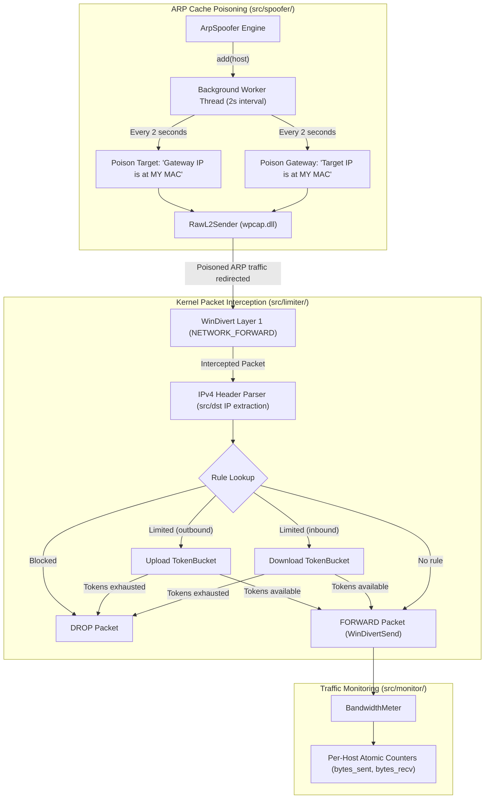

#### Token Bucket Rate Limiter

The `TokenBucket` implements a classic token-bucket algorithm with high-resolution timing:

```
Capacity (burst) = rate_bps * 2 (default)
Refill rate      = rate_bps bits/second
Consumption      = packet_size_bytes * 8 bits per packet

For each intercepted packet:
  1. elapsed = now - last_refill
  2. tokens += elapsed * rate_bps (capped at capacity)
  3. if tokens >= packet_bits: consume → FORWARD
  4. else: DROP (throttle)
```

#### ARP Restoration on Cleanup

When a device is freed (`free` command) or Rustrict exits (`quit`/`exit`), the spoofer sends **3 bursts** of legitimate ARP replies to both the target and gateway, restoring the authentic MAC-to-IP bindings and undoing the cache poisoning.

---

### 6. State & Persistence Subsystem

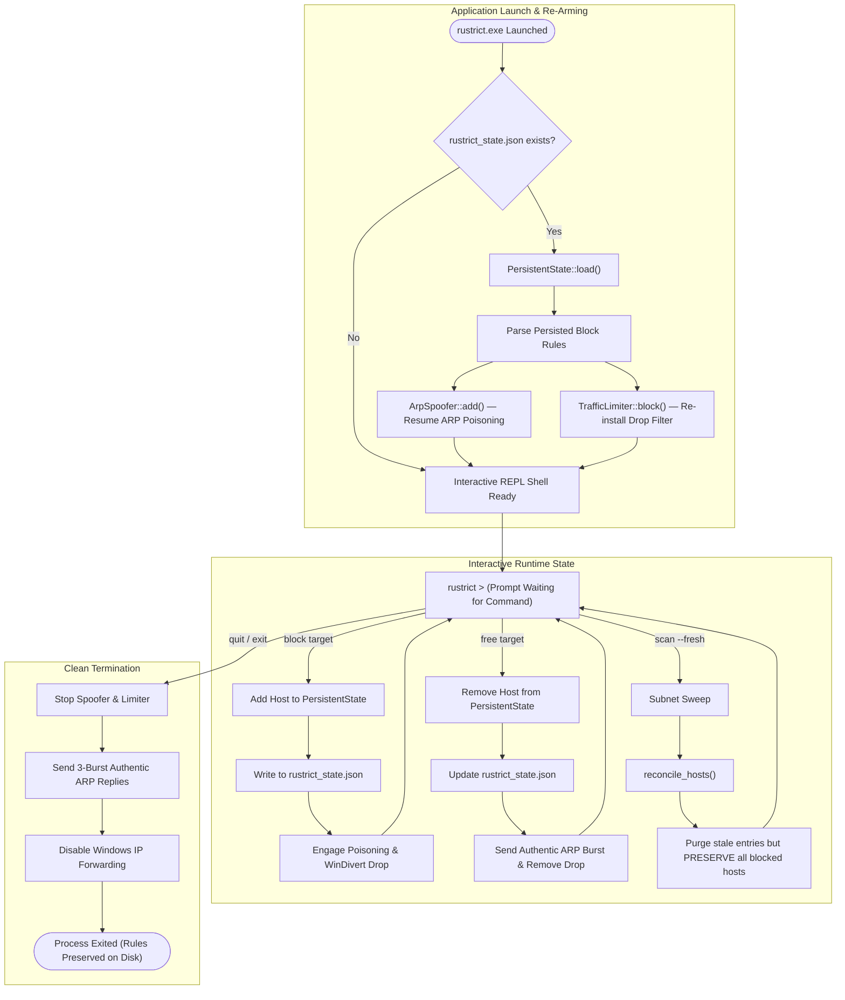

**Persistence format** (`rustrict_state.json`):
```json
{
  "blocked_hosts": [
    {
      "ip": "192.168.18.50",
      "mac": "a4:83:e7:21:00:19",
      "name": "Lakshyas-iPhone",
      "direction": "Both"
    }
  ]
}
```

**Critical invariant:** During `scan --fresh`, the reconciliation algorithm **never** prunes hosts that have `persistent_block = true` or an active `HostStatus::Blocked` / `HostStatus::Limited` status — even if they are offline and absent from the fresh scan results.

---

### 7. Wireless Subsystem (802.11)

The wireless module provides low-level 802.11 frame analysis capabilities:

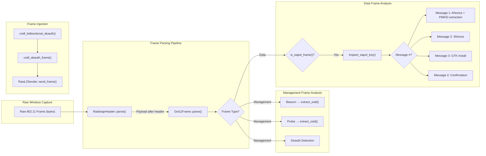

**Capabilities:**
- **Deauthentication frame crafting:** Generates valid IEEE 802.11 management frames (Frame Control `0x00c0`) with configurable reason codes. Bidirectional mode sends both AP→Client (Reason 7: Class 3 frame from nonassociated STA) and Client→AP (Reason 3: STA leaving) frames.
- **Radiotap header parsing:** Zero-copy extraction of channel frequency (MHz) and signal strength (dBm) from monitor-mode captures.
- **802.11 frame parsing:** Decodes Frame Control, addresses (Receiver, Transmitter, BSSID), To/From DS bits, and management subtypes (Beacon, Probe, Auth, Deauth, Disassociation).
- **WPA/WPA2 handshake inspection:** Identifies all four EAPOL-Key messages in the 4-way handshake by analyzing key info flags (`Pairwise`, `Install`, `ACK`, `MIC`). Extracts **PMKID** from RSN KDE tag (`00-0F-AC-04`) in Message 1.

---

## End-to-End Data Flow

### Device Discovery Pipeline

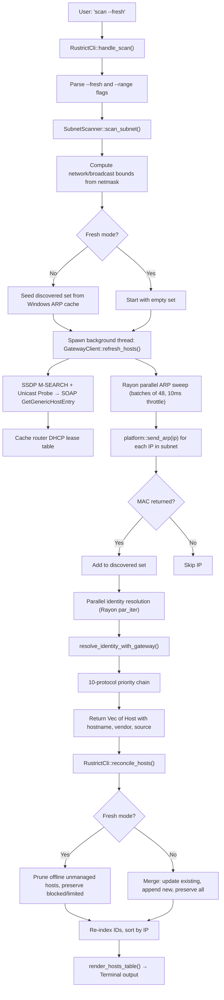

### Traffic Throttling & MITM Pipeline

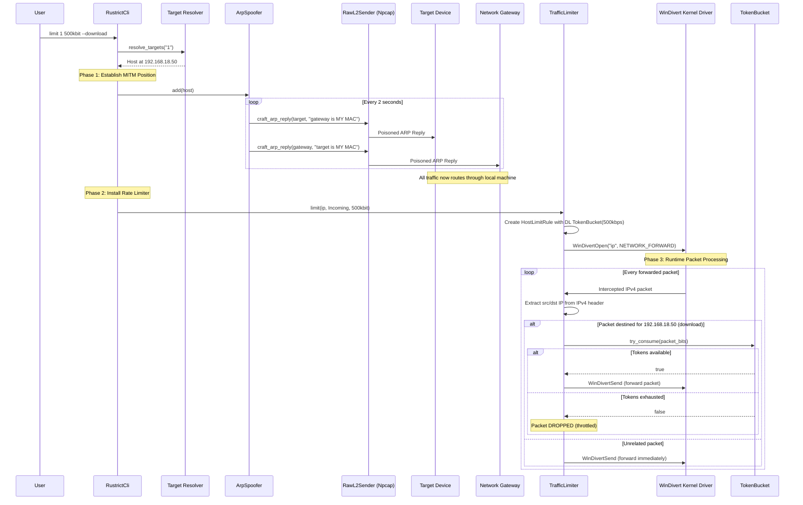

### Persistent Block Lifecycle

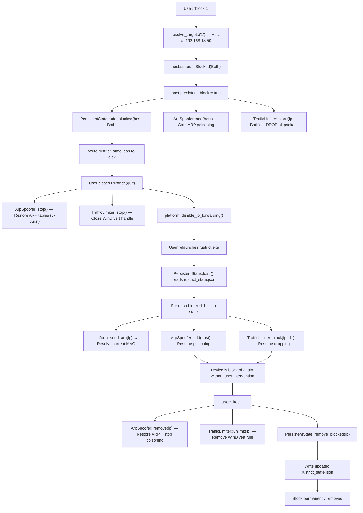

---

## CLI Command Reference

### Interactive Shell Commands

| Command | Syntax | Description |
| :--- | :--- | :--- |
| **`scan`** | `scan [--range <start-end>] [--fresh]` | Discovers online hosts via parallel ARP sweep. `--fresh` purges stale offline entries while preserving active rules. `--range 100-200` limits scan to a specific host range within the subnet. |
| **`hosts`** | `hosts` | Displays the current device inventory table with IP, MAC, verified hostname, vendor, online/offline state, and management status (Free / Limited / Blocked). Merges any passively discovered DHCP identities. |
| **`limit`** | `limit <targets> <rate> [--upload] [--download]` | Throttles device bandwidth. Targets can be device IDs (`1`), IP addresses (`192.168.18.50`), comma-separated lists (`1,192.168.18.50`), or `all`. Rate supports `bit`, `kbit`, `mbit`, `gbit` units. Direction defaults to `Both`. |
| **`block`** | `block <targets> [--upload] [--download]` | Completely cuts off device internet access by dropping all forwarded packets. **Persists across restarts** — blocked devices are saved to `rustrict_state.json` and automatically re-armed on next launch. |
| **`free`** | `free <targets>` | Removes all limits and blocks for specified devices. Restores authentic ARP cache entries. Removes persistent block rules from disk. |
| **`add`** | `add <ip> [--mac <mac>]` | Manually inserts a device into the management table. If `--mac` is omitted, the MAC is resolved via the Windows kernel ARP API. |
| **`clear`** | `clear` / `cls` | Clears the terminal screen. |
| **`help`** | `help` / `?` | Displays command reference. |
| **`exit`** | `quit` / `exit` | Stops all spoofing, restores ARP tables, disables IP forwarding, and exits cleanly. |

### Target Resolution Syntax

Targets support flexible mixed-format addressing:

```
rustrict > block 1                    # By device ID
rustrict > block 192.168.18.50        # By IPv4 address
rustrict > block 1,2,3                # Multiple IDs
rustrict > block 1,192.168.18.50,3    # Mixed IDs and IPs
rustrict > block all                  # All discovered devices
rustrict > limit all 200kbit          # Throttle entire network
```

---

## Requirements

| Requirement | Details |
| :--- | :--- |
| **Operating System** | Windows 10 / 11 (x86_64) |
| **Privileges** | Administrator terminal (PowerShell or Command Prompt) |
| **Npcap** | [npcap.com](https://npcap.com/) — installed in **WinPcap API-compatible mode** |
| **WinDivert** | `WinDivert.dll` + `WinDivert64.sys` — auto-bundled by `build.rs` or manually placed alongside `rustrict.exe` |
| **Rust Toolchain** | `rustc` / `cargo` 1.75+ (for building from source) |

---

## Building from Source

```powershell
# Clone the repository
git clone https://github.com/Neutron-0/rustrict.git
cd rustrict

# Build optimized release binary
cargo build --release

# Run the test suite (26 tests)
cargo test

# Launch (Administrator terminal required)
.\target\release\rustrict.exe
```

The compiled binary is located at `target\release\rustrict.exe`. WinDivert drivers are automatically copied to the release directory by the build script.

---

## Project Structure

```
rustrict/
├── Cargo.toml                    # Package manifest (rustrict v2.0.0)
├── Cargo.lock                    # Dependency lockfile
├── build.rs                      # Build script: auto-bundles WinDivert binaries
├── .gitignore                    # Excludes target/, state file, IDE configs
├── README.md                     # This document
│
├── src/
│   ├── main.rs                   # Binary entry point: banner, elevation check, REPL launch
│   ├── lib.rs                    # Library root: exports all 11 modules
│   ├── types.rs                  # Core types: MacAddress, Host, BitRate, Direction, HostStatus, NameSource
│   │
│   ├── cli/
│   │   ├── mod.rs                # CLI module exports
│   │   ├── banner.rs             # ASCII art banner renderer
│   │   ├── prompt.rs             # RustrictCli: REPL loop, command handlers, reconciliation logic
│   │   └── table.rs              # Host inventory table renderer (comfy-table)
│   │
│   ├── platform/
│   │   ├── mod.rs                # Platform gate: compile_error for non-Windows
│   │   └── windows.rs            # Windows API bindings: SendARP, IsUserAnAdmin, PowerShell commands
│   │
│   ├── scanner/
│   │   ├── mod.rs                # Scanner module exports
│   │   └── arp.rs                # SubnetScanner: parallel ARP sweep, batch throttling, gateway integration
│   │
│   ├── resolver/
│   │   ├── mod.rs                # Identity resolver: 10-protocol priority chain, HTTP title probe
│   │   ├── passive.rs            # PassiveIdentitySniffer: background DHCP Option 12 capture
│   │   ├── oui.rs                # OUI vendor database (25+ manufacturers)
│   │   ├── smb.rs                # SMB2 NTLMSSP Type 2 challenge hostname extraction
│   │   ├── tls.rs                # TLS X.509 certificate Common Name parser
│   │   ├── netbios.rs            # NetBIOS NBNS Node Status Query (UDP 137)
│   │   ├── mdns.rs               # mDNS reverse PTR lookup (UDP 5353)
│   │   ├── llmnr.rs              # LLMNR PTR query (UDP 5355)
│   │   └── dns.rs                # Reverse DNS via nslookup
│   │
│   ├── gateway/
│   │   ├── mod.rs                # GatewayClient: caching coordinator
│   │   ├── ssdp.rs               # SSDP M-SEARCH + unicast HTTP probe for UPnP service discovery
│   │   ├── soap.rs               # SOAP request executor + XML tag extractor
│   │   └── hosts.rs              # GatewayHostEntry struct
│   │
│   ├── spoofer/
│   │   ├── mod.rs                # Spoofer module exports
│   │   ├── engine.rs             # ArpSpoofer: background poisoning worker, ARP restoration
│   │   └── raw_l2.rs             # RawL2Sender: Npcap pcap_sendpacket, ARP frame crafting
│   │
│   ├── limiter/
│   │   ├── mod.rs                # Limiter module exports
│   │   ├── divert.rs             # TrafficLimiter: WinDivert NETWORK_FORWARD packet filter
│   │   └── token_bucket.rs       # TokenBucket + SharedTokenBucket rate limiter
│   │
│   ├── monitor/
│   │   ├── mod.rs                # Monitor module exports
│   │   └── counter.rs            # BandwidthMeter: per-host atomic traffic counters
│   │
│   ├── wireless/
│   │   ├── mod.rs                # Wireless module exports
│   │   ├── deauth.rs             # 802.11 Deauthentication frame crafter
│   │   ├── frame.rs              # Dot11Frame parser, FrameType/ManagementSubtype enums
│   │   ├── handshake.rs          # WPA 4-way handshake inspector, PMKID extractor
│   │   └── radiotap.rs           # Radiotap header parser (channel freq, signal dBm)
│   │
│   └── state.rs                  # PersistentState: JSON serialization for durable block rules
│
└── tests/
    ├── unit_tests.rs             # MAC formatting, OUI lookup, BitRate parsing, TokenBucket, ARP crafting, Deauth, EAPOL
    ├── test_dhcp.rs              # DHCP Option 12 packet parsing
    ├── test_smb.rs               # SMB2 NTLMSSP Type 2 challenge parsing
    ├── test_tls.rs               # X.509 certificate CN extraction
    ├── test_gateway.rs           # SOAP XML parsing, SSDP header parsing, GatewayHostEntry construction
    └── test_target_resolution.rs # Target resolver: ID/IP/mixed/all, dedup, fresh rescan, persistence roundtrip
```

---

## Test Suite

Rustrict includes **26 automated tests** covering all critical subsystems:

| Test File | Tests | Coverage |
| :--- | :---: | :--- |
| `unit_tests.rs` | 7 | MAC formatting/parsing, OUI vendor lookup, BitRate unit parsing, TokenBucket rate-limiting, Layer 2 ARP reply frame crafting, 802.11 Deauth frame generation, EAPOL frame detection |
| `test_target_resolution.rs` | 12 | Target resolution by ID, by IP, mixed lists, `all` keyword, deduplication, unknown ID/IP errors, ambiguous records, non-destructive upsert, fresh rescan pruning with blocked device preservation, PersistentState roundtrip |
| `test_gateway.rs` | 4 | SOAP XML tag extraction, missing tag handling, SSDP response header parsing, GatewayHostEntry construction |
| `test_dhcp.rs` | 1 | DHCP Option 12 (Host Name) extraction from raw BOOTP packet bytes |
| `test_smb.rs` | 1 | SMB2 NTLMSSP Type 2 challenge AV_PAIR parsing (MsvAvDnsComputerName / MsvAvNbComputerName) |
| `test_tls.rs` | 1 | X.509 certificate Common Name extraction via ASN.1 OID `2.5.4.3` |

Run the full suite:
```powershell
cargo test
```

---

## External Dependencies

| Dependency | Type | Purpose |
| :--- | :--- | :--- |
| **WinDivert** (`WinDivert.dll`, `WinDivert64.sys`) | Kernel driver + DLL | Intercepts IPv4 packets at the `NETWORK_FORWARD` layer for bandwidth throttling and packet dropping. Dynamically loaded at runtime. |
| **Npcap** (`wpcap.dll`) | User-mode DLL | Raw Layer 2 Ethernet frame transmission (`pcap_sendpacket`) for ARP spoofing, promiscuous packet capture (`pcap_open_live` / `pcap_next_ex`) for passive DHCP snooping. |
| **Windows iphlpapi.dll** | System DLL | Native `SendARP` API for synchronous kernel-level ARP resolution during subnet scanning. |
| **PowerShell** | System utility | Network interface discovery (`Get-NetRoute`, `Get-NetIPAddress`, `Get-NetAdapter`) and IP forwarding management (`Set-NetIPInterface`). |